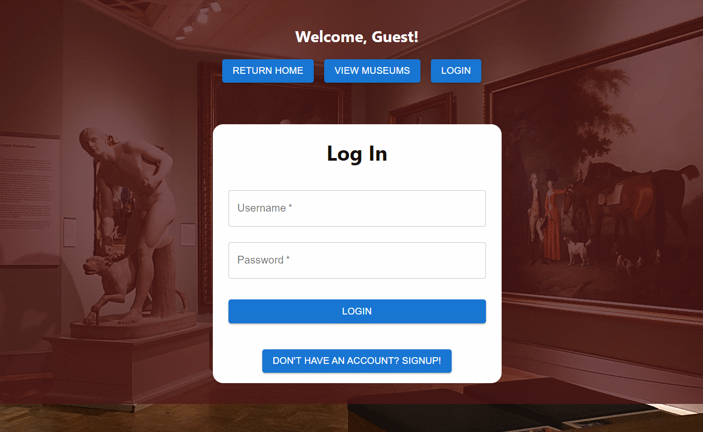
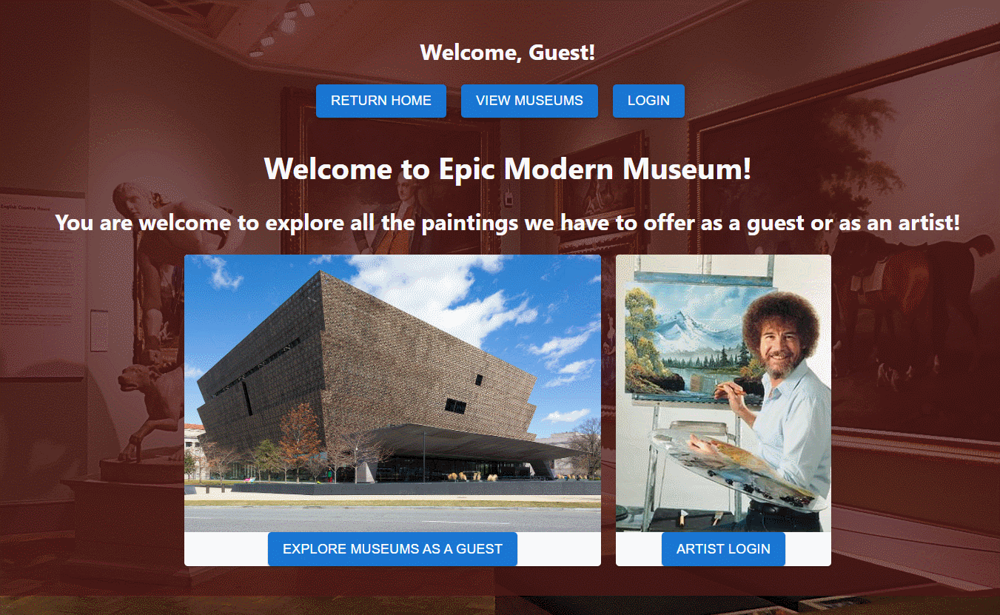

# Epic Modern Museum

## Description

This application is designed to host various museums and paintings uploaded by artists. Artists can create an account and upload any painting of their choosing. 

The users have the ability to edit and delete their own paintings but they are not allowed to change or delete the paintings of others.

[Sample Website](https://epic-modern-museum.onrender.com)

## General Usage

1. User will be greeted by the homepage, which displays two choices. User can either view museums as a guest or log in as an artist.

2. To view museums, click on 'EXPLORE MUSEUMS AS A GUEST' on the home page or 'VIEW MUSEUMS' on the navigation bar.

3. To view an individual museum, click on 'EXPLORE!' under any of the museum cards.

4. The museum profile page will display information about the museum as well as a list of paintings hosted at its gallery.

5. Clicking on 'MORE' for any of the paintings will display an enlarged version of the image along with relevant information.

## For Logged In Users

1. User will be greeted by the homepage, which displays two choices. User can either view museums as a guest or log in as an artist.

2. To view user profile, click on 'ARTIST LOGIN' or 'LOGIN' on the navigation bar.

3. On the login page, user has the option to login as an existing user or to signup as a new one.

4. Once logged in, the user will be taken to their profile page which displays their biography, paintings and all museums the user is a part of.

5. Clicking on 'MORE' for any of the paintings will display an enlarged version of the image along with relevant information.

6. Users have the ability to click on 'EDIT' on the bottom of the card to change any parameters or to delete their painting.

## Examples:

Creating a new user:

Viewing Museums:

Modifying Paintings:

## Project Status

5/23/23 - Completed version 0.1

## Planned Features

1. Ability to directly upload images

2. View other artist's profiles

## Credits  

- [Open ClipArt](https://openclipart.org) for default seed images

- [Wikipedia](https://www.wikipedia.org) for frontpage images for Museum and Bob Ross

## Author

This application is by Eric Song who is currently studying the Flex program at Flatiron School.

[Github](https://github.com/ericksong91)

[Linkedin](https://www.linkedin.com/in/eric-song-45597062)

## Contributing 
Pull requests are welcome. For major changes, please open an issue first to discuss what you would like to change.

Please make sure to update tests as appropriate.

## License
[MIT](https://choosealicense.com/licenses/mit/)